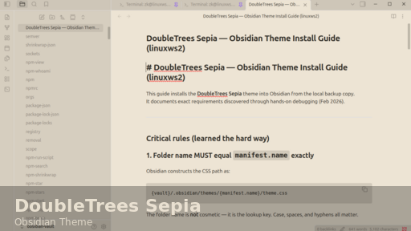

# DoubleTrees Sepia

A warm, parchment-style Obsidian theme inspired by the DoubleTrees aesthetic.

- **Name (Theme Gallery):** DoubleTrees Sepia
- **Author:** 0xWulf
- **Repo:** https://github.com/hexawulf/doubletrees-sepia
- **Min Obsidian version:** 1.5.0

## Screenshots

## Install

### From Obsidian Theme Gallery (once accepted)
Settings → Appearance → Themes → Manage → search **DoubleTrees Sepia** → Install and use.

### Manual install (local)
1. Open your vault folder.
2. Go to: `.obsidian/themes/`
3. Create folder: `DoubleTrees Sepia` *(must match `manifest.json` → `name` exactly)*
4. Put these files inside:
   - `manifest.json`
   - `theme.css`
5. Restart Obsidian (or switch themes) to reload.

## Development notes

- All styles live in `theme.css`.
- Release assets should include `manifest.json` and `theme.css`.

## License

MIT (same as the Obsidian sample theme template).
